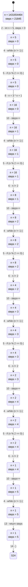

```mermaid
stateDiagram-v2
    S0: n = 1431654464<br>steps = 21845
    S1: n = 5<br>steps = 0
    S2: n = 5<br>steps = 0
    S3: n = 5<br>steps = 0
    S4: n = 16<br>steps = 0
    S5: n = 16<br>steps = 1
    S6: n = 16<br>steps = 1
    S7: n = 16<br>steps = 1
    S8: n = 8<br>steps = 1
    S9: n = 8<br>steps = 2
    S10: n = 8<br>steps = 2
    S11: n = 8<br>steps = 2
    S12: n = 4<br>steps = 2
    S13: n = 4<br>steps = 3
    S14: n = 4<br>steps = 3
    S15: n = 4<br>steps = 3
    S16: n = 2<br>steps = 3
    S17: n = 2<br>steps = 4
    S18: n = 2<br>steps = 4
    S19: n = 2<br>steps = 4
    S20: n = 1<br>steps = 4
    S21: n = 1<br>steps = 5
    S22: n = 1<br>steps = 5
    S23: n = 1<br>steps = 5
    S24: 
    [*] --> S0
    S0 --> S1 : 2 - int n = 5, steps = 0
    S1 --> S2 : 4 - while (n != 1) {
    S2 --> S3 : 5 - if (n % 2 == 0) {
    S3 --> S4 : 8 - n = 3 * n + 1
    S4 --> S5 : 10 - steps++
    S5 --> S6 : 4 - while (n != 1) {
    S6 --> S7 : 5 - if (n % 2 == 0) {
    S7 --> S8 : 6 - n /= 2
    S8 --> S9 : 10 - steps++
    S9 --> S10 : 4 - while (n != 1) {
    S10 --> S11 : 5 - if (n % 2 == 0) {
    S11 --> S12 : 6 - n /= 2
    S12 --> S13 : 10 - steps++
    S13 --> S14 : 4 - while (n != 1) {
    S14 --> S15 : 5 - if (n % 2 == 0) {
    S15 --> S16 : 6 - n /= 2
    S16 --> S17 : 10 - steps++
    S17 --> S18 : 4 - while (n != 1) {
    S18 --> S19 : 5 - if (n % 2 == 0) {
    S19 --> S20 : 6 - n /= 2
    S20 --> S21 : 10 - steps++
    S21 --> S22 : 4 - while (n != 1) {
    S22 --> S23 : 13 - return steps
    S23 --> S24 : 14 - }
```
