# 程序状态迁移图

```mermaid
stateDiagram-v2
    S1: steps = 21845
    S2: n = 5<br>steps = 0
    S3: n = 5<br>steps = 0
    S4: n = 5<br>steps = 0
    S5: n = 16<br>steps = 0
    S6: n = 16<br>steps = 1
    S7: n = 16<br>steps = 1
    S8: n = 16<br>steps = 1
    S9: n = 8<br>steps = 1
    S10: n = 8<br>steps = 2
    S11: n = 8<br>steps = 2
    S12: n = 8<br>steps = 2
    S13: n = 4<br>steps = 2
    S14: n = 4<br>steps = 3
    S15: n = 4<br>steps = 3
    S16: n = 4<br>steps = 3
    S17: n = 2<br>steps = 3
    S18: n = 2<br>steps = 4
    S19: n = 2<br>steps = 4
    S20: n = 2<br>steps = 4
    S21: n = 1<br>steps = 4
    S22: n = 1<br>steps = 5
    S23: n = 1<br>steps = 5
    S24: n = 1<br>steps = 5
    [*] --> S1
    S1 --> S2 : 2 - int n = 5, steps = 0;
    S2 --> S3 : 4 - while (n != 1) 
    S3 --> S4 : 5 - if (n % 2 == 0) 
    S4 --> S5 : 8 - n = 3 * n + 1;
    S5 --> S6 : 10 - steps++;
    S6 --> S7 : 4 - while (n != 1) 
    S7 --> S8 : 5 - if (n % 2 == 0) 
    S8 --> S9 : 6 - n = n / 2;
    S9 --> S10 : 10 - steps++;
    S10 --> S11 : 4 - while (n != 1) 
    S11 --> S12 : 5 - if (n % 2 == 0) 
    S12 --> S13 : 6 - n = n / 2;
    S13 --> S14 : 10 - steps++;
    S14 --> S15 : 4 - while (n != 1) 
    S15 --> S16 : 5 - if (n % 2 == 0) 
    S16 --> S17 : 6 - n = n / 2;
    S17 --> S18 : 10 - steps++;
    S18 --> S19 : 4 - while (n != 1) 
    S19 --> S20 : 5 - if (n % 2 == 0) 
    S20 --> S21 : 6 - n = n / 2;
    S21 --> S22 : 10 - steps++;
    S22 --> S23 : 4 - while (n != 1) 
    S23 --> S24 : 13 - return steps;
```



## 状态详情

| 状态ID | 行号 | 代码 | 变量 |
|--------|------|------|------|
| S1 | 2 | `int n = 5, steps = 0;` | steps=21845 |
| S2 | 4 | `while (n != 1) {` | n=5<br>steps=0 |
| S3 | 5 | `if (n % 2 == 0) {` | n=5<br>steps=0 |
| S4 | 8 | `n = 3 * n + 1;` | n=5<br>steps=0 |
| S5 | 10 | `steps++;` | n=16<br>steps=0 |
| S6 | 4 | `while (n != 1) {` | n=16<br>steps=1 |
| S7 | 5 | `if (n % 2 == 0) {` | n=16<br>steps=1 |
| S8 | 6 | `n = n / 2;` | n=16<br>steps=1 |
| S9 | 10 | `steps++;` | n=8<br>steps=1 |
| S10 | 4 | `while (n != 1) {` | n=8<br>steps=2 |
| S11 | 5 | `if (n % 2 == 0) {` | n=8<br>steps=2 |
| S12 | 6 | `n = n / 2;` | n=8<br>steps=2 |
| S13 | 10 | `steps++;` | n=4<br>steps=2 |
| S14 | 4 | `while (n != 1) {` | n=4<br>steps=3 |
| S15 | 5 | `if (n % 2 == 0) {` | n=4<br>steps=3 |
| S16 | 6 | `n = n / 2;` | n=4<br>steps=3 |
| S17 | 10 | `steps++;` | n=2<br>steps=3 |
| S18 | 4 | `while (n != 1) {` | n=2<br>steps=4 |
| S19 | 5 | `if (n % 2 == 0) {` | n=2<br>steps=4 |
| S20 | 6 | `n = n / 2;` | n=2<br>steps=4 |
| S21 | 10 | `steps++;` | n=1<br>steps=4 |
| S22 | 4 | `while (n != 1) {` | n=1<br>steps=5 |
| S23 | 13 | `return steps;` | n=1<br>steps=5 |
| S24 | 15 | `}` | n=1<br>steps=5 |

## 完整执行路径

```
S1: 行 2 -> S2
S2: 行 4 -> S3
S3: 行 5 -> S4
S4: 行 8 -> S5
S5: 行 10 -> S6
S6: 行 4 -> S7
S7: 行 5 -> S8
S8: 行 6 -> S9
S9: 行 10 -> S10
S10: 行 4 -> S11
S11: 行 5 -> S12
S12: 行 6 -> S13
S13: 行 10 -> S14
S14: 行 4 -> S15
S15: 行 5 -> S16
S16: 行 6 -> S17
S17: 行 10 -> S18
S18: 行 4 -> S19
S19: 行 5 -> S20
S20: 行 6 -> S21
S21: 行 10 -> S22
S22: 行 4 -> S23
S23: 行 13 -> S24
S24: 行 15
```
